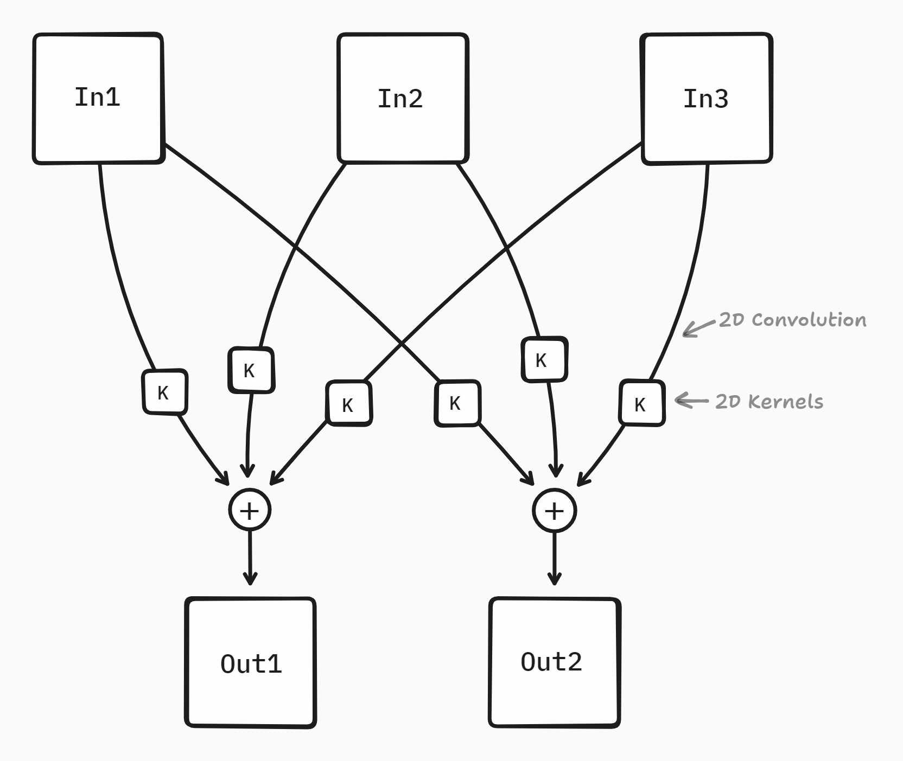
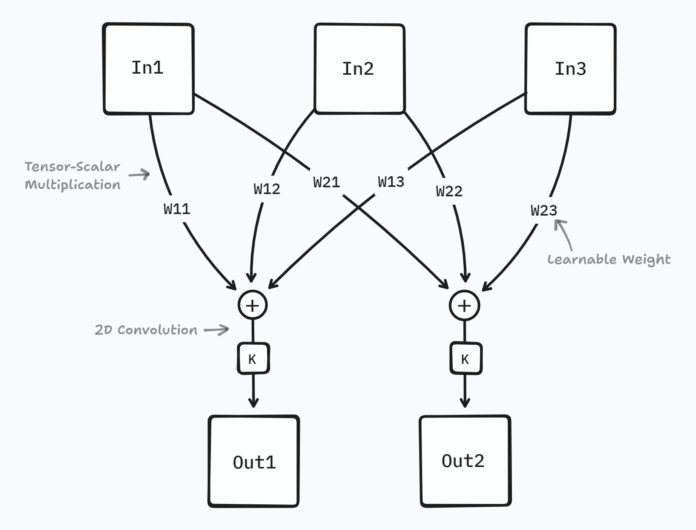
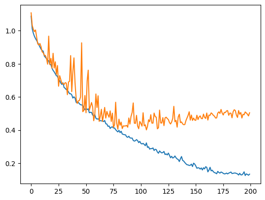
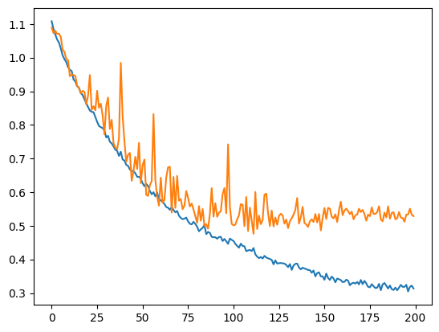

# Introduction 

This is a simple deep learning project focusing on optimizing PyTorch code to perform better with GPU. It is also an exploration with Convolutional Neural Network (CNN) achitecture, specifically [ResNet][5]. 

# Basic optimizations

The code for training a deep CNN model is modified following the ["Performance Tuning Guide"][6] to fully utilize available GPUs. The training speed was improve significantly [-- just trust me][7]. 

Applied optimizations from the article:

- [Use parameter.grad = None instead of model.zero_grad() or optimizer.zero_grad()](https://pytorch.org/tutorials/recipes/recipes/tuning_guide.html#use-parameter-grad-none-instead-of-model-zero-grad-or-optimizer-zero-grad)
- [Avoid unnecessary CPU-GPU synchronization](https://pytorch.org/tutorials/recipes/recipes/tuning_guide.html#avoid-unnecessary-cpu-gpu-synchronization)
- [Use efficient data-parallel backend](https://pytorch.org/tutorials/recipes/recipes/tuning_guide.html#use-efficient-data-parallel-backend)

Further improvements:

- Move image agumentations to GPU.
- [Use decaying learning rate][8]

> [!NOTE]
> Using `torch.compile` might help improve the the training speed even further but Kaggle's GPU was older than the required version for `torch.compile`. Thus it is worth running the model on a different machine.

# Sub-kernels vs Channels Selection Convolution Layer

Without bias, the learnable weights of a Conv2d module follows the shape:

$$
\begin{equation} 
    (C_\texttt{out}, 
    \frac{C_\texttt{in}}{\texttt{groups}},  K_\texttt{row}, K_\texttt{col})
\end{equation}
$$

where, by default, $\texttt{groups}=1$ ([PyTorch - Conv2d][1]). Base on $(1)$ the total number of trainable parameters (not including bias) would be:

$$
\begin{equation} 
C_\texttt{in} 
\times C_\texttt{out} 
\times K_\texttt{row} 
\times K_\texttt{col}
\end{equation}
$$

A typical Conv2d layer (with groups=1) uses individual **sub-kernels** on each input channels then add up those results for an output channel. This repeat for every out-channels in a layer. 

<div align='center' style='padding: 0 20%;'>


Sub-kernels based convolution (torch Conv2d with groups=1)

</div>

In this experiment, instead of applying multiple sub-kernels for each output channels, all input channels is weighted sum multiple times for the total of output channels. Each weighted sum uses different set of learnable weights to achieve the idea of input **channels selection** for specific output channels. Individual kernels (with the size of output channels) is then applied to each weighted sum channels.

<div align='center' style='padding: 0 20%;'>


Channels selection convolution (weighted sum over the input channels for each output channels)

</div>

The total learnable parameters for this convolution layer is (without bias):

$$
\begin{equation}
C_\texttt{in} 
\times 
C_\texttt{out} 
+ 
C_\texttt{out}
\times 
K
\end{equation}
$$

where $K= K_\texttt{row} \times K_\texttt{col}$. Expression $(2)$ is larger than $(3)$ for any $C_\texttt{in} > \frac{K}{K-1}, \texttt{for} K\neq0$. For a typical $3\times 3$ kernels layer, the input channels need to be larger than $9/8 \approx 1$.

Proof:

$$
\begin{split}
\texttt{assuming } (2) & > (3) \\
C_\texttt{in}\cdot C_\texttt{out}\cdot K & > C_\texttt{in}\cdot C_\texttt{out} + C_\texttt{out} \cdot K \\
C_\texttt{in}\cdot K & > C_\texttt{in} + K \\
C_\texttt{in}( K - 1) & > K \\
C_\texttt{in} & > \frac{K}{K - 1}, \; K \neq 0 \\
\end{split}
$$

# Implementation

## Bad Implementation

```py
import torch.nn as nn

class WeightedSumConv2d(nn.Module):
    def __init__(self, in_channels, out_channels):
        # use pytorch Linear layer for channels selection (weighted sum)
        self.fc = nn.Linear(
            in_channels, 
            out_channels, 
            bias=False)

        # use pytorch Conv2d with groups=out_channels for convolution
        self.conv2d = nn.Conv2d(
            out_channels, 
            out_channels, 
            # additional arguments
            groups=out_channels)

    # (N = batch size, C_in = in_channels, C_out = out_channels)
    #                                   shape of x:
    def forward(self, x):               # (N, C_in,  W, H    )
        x = x.permute(0, 2, 3, 1)       # (N, W,     H, C_in )
        x = self.fc(x)                  # (N, W,     H, C_out)
        x = x.permute(0, 3, 1, 2)       # (N, C_out, W, H    )
        return conv2d(x) 
```

Although the Conv2d with channels selection required less computations with lower number of learnable parameters, the training time take around twice longer (for small epochs) than with normal Conv2d layer.

| Runs          | Channels selection time (s/10epochs) | Sub kernels (s/10epochs) |
| ------------- | ------------------------------------ | ------------------------ |
| 1             | 85.455                               | 48.41                    |
| 2             | 85.3                                 | 49.54                    |
| 3             | 84.816                               | 47.89                    |
| 4             | 84.854                               | 47.66                    |
| 5             | 85                                   | 47.15                    |
| **Avg (s/epoch)** | 8.5085                               | 4.81286                  |

This might be due to the unoptimized and, in a way, unconventional operations required (tensor weighted sum, etc). 

## Good Implementation

The previous implementation is quite inefficient. An improved version uses `nn.Conv2d` with `kernel_size=1` for the weighted sum layer.

```py
class WeightedSumConv2d(nn.Module):
    def __init__(
            self, 
            in_channels, 
            out_channels, 
            stride=1, 
            kernel_size=3, 
            padding=0
        ):
        super(WeightedSumConv2d, self).__init__()
        self.weighted_sum = nn.Conv2d(
            in_channels, 
            out_channels, 
            kernel_size=1, 
            bias=False
        )
        self.batch_conv = BatchedConv2d(
            in_channels=out_channels,
            out_channels=out_channels,
            stride=stride,
            kernel_size=kernel_size,
            padding=padding,
            groups=out_channels
        )

    def forward(self, x):
        x = self.weighted_sum(x)
        x = self.batch_conv(x)
        return x
```

| Runs          | Improved channels selection time (s/10epochs) |
| ------------- | --------------------------------------------- |
| 1             | 47.429                                        |
| 2             | 48.931                                        |
| 3             | 49.191                                        |
| 4             | 47.239                                        |
| 5             | 47.797                                        |
| Avg (s/epoch) | 4.81174                                       |

# Test Dataset

The idea of channels selection is tested on the [dog-vs-cat-vs-bird][3] competition/dataset against the sub-kernels convolution. The dataset consists of 12k labeled images divided evenly among three classes (dog, cat, and bird), each input image has the dimension of 32x32. 

There were many iterations between model shapes and depth but the final implementation settle with the following configuration:

<div align='center' style='margin: 0 auto; width: 50%;'>

```mermaid
flowchart-elk TD
    classDef empty width:0px;
    classDef box height:35px,line-height:12px,text-align:center;
    A[3x3 conv, 16]:::box
    B01[3x3 conv, 16]:::box
    B02[3x3 conv, 16]:::box
    B0E[ ]:::empty
    B11[3x3 conv, 16]:::box
    B11[3x3 conv, 16]:::box
    B12[3x3 conv, 16]:::box
    B1E[ ]:::empty
    B21[3x3 conv, 32]:::box
    B22[3x3 conv, 32]:::box
    B2E[ ]:::empty
    B31[3x3 conv, 32]:::box
    B32[3x3 conv, 32]:::box
    B3E[ ]:::empty
    B41[3x3 conv, 64]:::box
    B42[3x3 conv, 64]:::box
    B4E[ ]:::empty
    B51[3x3 conv, 64]:::box
    B52[3x3 conv, 64]:::box
    B5E[ ]:::empty
    C[AvgeragePool2d]:::box
    D[Dropout 0.2]:::box
    E[FC 64x3]:::box

    A --- B01 --- B02 --- B0E
    A --- B0E
    B0E --- B11 --- B12 --- B1E
    B0E ---> B1E
    B1E --- B21 --- B22 --- B2E
    B1E -.-> B2E
    B2E --- B31 --- B32 --- B3E
    B2E --> B3E
    B3E --- B41 --- B42 --- B4E
    B3E -.-> B4E
    B4E --- B51 --- B52 --- B5E
    B4E --- B5E
    B5E --- C ---> D --- E
```

</div>

Each conv are: sub-kernels/channel-selection + batchnorm2d


<div align='center' style='margin: 0 auto; width: 100%;'>

```mermaid
flowchart-elk TD
    classDef empty width:0px;
    classDef box height:35px,line-height:12px,text-align:center;
    A[Conv2d]:::box
    B[BatchNorm2d]:::box

    A --- B
```

Conv2d: Sub-kernels or Channels selection

</div>

This ResNet inspired model is implemented twice for each type of convolution layer, by replacing the Conv2d. Jupyter notebooks for both implementations can be found in [`/notebooks/`](https://github.com/sokmontrey/channels-selection-convolution/tree/master/notebooks).

| Models                                | Channels selection + Kernels | Sub Kernels           |
| ------------------------------------- | ---------------------------- | --------------------- |
| Parameters (dog-cat-bird)                   | 27,363                       | 174,787               |
| Overfitting Epoch                     | ~80 (~50 val loss)           | ~80 (~0.42 val loss)  |
| Min Test Loss                         | 0.47613 (train: 0.43)        | 0.40116 (train: 0.32) |
| Submission Score                      | 81.53%                       | 84.17%                |
| ResNet18 Parameters (performance TBD) | ~1,958,824                   | [11,689,512][2]      |

> [!NOTE]
> Learnable parameters for ResNet18 with channels selection is calculated by replacing all Conv2d module with the WeightedSumConv2d module.

<div style='display: flex;'>
<div align='center'>



sub-kernels convolution based (blue: train losses, orange: validation losses)

</div>
<div align='center'>



channels selection convolution based (blue: train losses, orange: validation losses)

</div>
</div>

# Conclusion

It's natural to think that channels selection should performs worse than ordinary sub-kernels-based conv2d, which it did during the dog-cat-bird test. But a bigger problem occur during the experiments. The model with channels selection conv2d seem to be incapable of overfitting and unable to surpass a certain loss value, . This might depend on the high-level achitecture of the model and many other imperfection. 

Base on the performance from the [dog-cat-bird dataset][3], it is safe to say that the channel selection conv2d model perform worst than the ordinary sub-kernels convolution based model. The idea of channels selection convolution need to be tested with different benchmark/dataset.

It is also worth noting that throughout the experiment, different model shapes and hyperparameter were tested. But most, if not all, of the run has shown that the channels selection convolution is incapable to surpass a certain validation loss. Even in the case of intentionally overfitting the dataset. Further understanding of CNN required to tune a model with this convolution layers.

Channel selection has the speed roughly the same as the sub-kernels convolution, slightly faster in some cases. But its inability to overfit a dataset is a big trait of.

[1]: https://pytorch.org/docs/stable/generated/torch.nn.Conv2d.html#conv2d
[2]: https://pytorch.org/vision/main/models/generated/torchvision.models.resnet18.html
[3]: https://www.kaggle.com/competitions/dog-vs-cat-vs-bird/data
[4]: https://www.kaggle.com/competitions/dog-vs-cat-vs-bird
[5]: https://arxiv.org/abs/1512.03385
[6]: https://pytorch.org/tutorials/recipes/recipes/tuning_guide.html
[7]: https://www.goodreads.com/book/show/217389518-just-trust-me
[8]: https://pytorch.org/docs/stable/optim.html#how-to-adjust-learning-rate